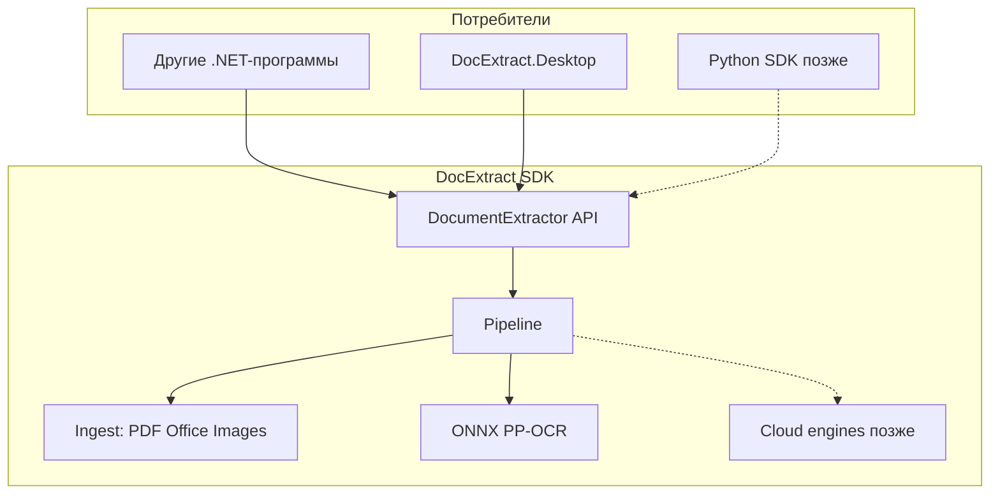
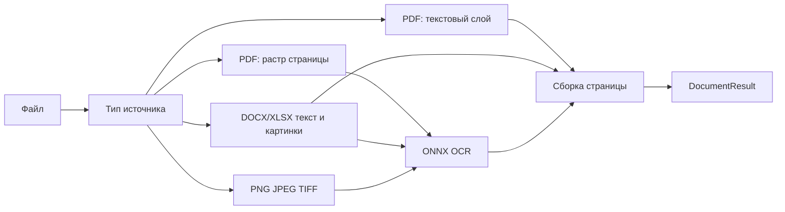

# Архитектура DocExtract

## Цель и границы

DocExtract — это **библиотека извлечения текста из документов** (универсальный OCR, без фиксированных типов вроде «инвойс/паспорт») плюс **десктоп для оператора**: очередь файлов, просмотр, правка, зоны/шаблоны, экспорт. Другие программы встраивают её как **in-process SDK** (сначала NuGet / C#, позже Python).

Первая рабочая версия сознательно узкая: **текст + координаты + пакетная обработка**. Таблицы, поля, рукопись, галочки, QR и печати — в [docs/ROADMAP.md](docs/ROADMAP.md), не в MVP.

## Стек (принятые решения)

| Решение | Выбор | Почему |
|---|---|---|
| Ядро SDK | **C# / .NET 10** | Windows-first, нормальный NuGet, сильный десктоп, ONNX Runtime и DirectML из коробки |
| Десктоп | **Avalonia** | Сейчас Windows, позже Linux/macOS без переписывания UI (WPF это закрыл бы) |
| API для программ | **In-process библиотека** | Как вы выбрали; HTTP/gRPC/CLI не делаем продуктом в MVP |
| OCR | **PP-OCRv4/v5 через ONNX Runtime** (как RapidOCR) | Лучший локальный баланс RU+EN, поставка без Python; Tesseract — опциональный движок позже |
| GPU | **CPU по умолчанию, DirectML опционально** | На Windows ускорение без CUDA-зависимости |
| PDF | **Текстовый слой сначала**, OCR только страниц-картинок | PdfPig (текст) + Pdfium/PDFtoImage (растр) |
| Office | **Open XML**: DOCX/XLSX текст + картинки из файла в OCR | Без Word Interop, чтобы SDK не требовал Office |
| Лицензия | **Apache-2.0** | Привычно для SDK, совместимо с ONNX Runtime, Tesseract, большинством PP-OCR моделей, Avalonia (MIT) |
| Поставка | **Self-contained установщик Windows + отдельный NuGet** | Модели печатных RU+EN **внутри установщика**; в NuGet модели — отдельным пакетом `DocExtract.Models`, чтобы не раздувать ссылку у разработчиков |
| Языки UI | **ru / en**, переключение | ResX в десктопе |
| Комментарии/README/roadmap | **Русский** | Имена публичного API — **английские** (иначе SDK неудобен внешним потребителям) |

Python-пакет **не пишем в MVP**, но закладываем стабильный JSON-результат и возможность позже выгрузить NativeAOT C-ABI (ctypes) — это реальный in-process путь, в отличие от pythonnet.

## Структура репозитория

```
DocExtract/
  src/
    DocExtract/                 # публичный SDK (NuGet)
    DocExtract.Engines.Onnx/    # локальный ONNX-движок
    DocExtract.Desktop/         # операторское приложение
  tests/
    DocExtract.Tests/
    fixtures/                   # синтетические PDF/DOCX/PNG
  models/                       # веса det/rec/cls RU+EN (не исходники; копируются в установщик)
  docs/
    ROADMAP.md                  # этапы после MVP
    ARCHITECTURE.md             # этот контур для людей
  README.md
  Directory.Build.props
  DocExtract.slnx
```

Слои SDK внутри `DocExtract` (папки, не обязательно отдельные проекты):

- `Api` — публичные типы, единственная поверхность для потребителей
- `Ingest` — PDF / Office / растр → список страниц (текст и/или картинка + DPI)
- `Ocr` — `IOcrEngine`, препроцесс, склейка результата
- `Geometry` — единая система координат
- `Export` — plain text и JSON

Десктоп **только ссылается на SDK**, без копипасты пайплайна.



## Публичный API (MVP)

Один вход, async, `CancellationToken`, без статического глобального состояния.

```csharp
var extractor = new DocumentExtractor(new ExtractorOptions
{
    Languages = ["ru", "en"],
    PreferEmbeddedText = true,          // стратегия PDF
    Gpu = GpuPreference.Auto,           // None | Auto | DirectML
    RenderDpi = 200
});

DocumentResult doc = await extractor.ExtractAsync(DocumentSource.FromFile(path));

RegionResult part = await extractor.ExtractRegionAsync(
    DocumentSource.FromFile(path),
    new PageRegion(pageIndex: 0, normalizedBounds: new Box(0.1, 0.2, 0.4, 0.15)));
```

`DocumentResult`:

- метаданные источника, число страниц, опции прогона
- страницы: размер в пикселях, DPI, `Rotation`, полный текст
- иерархия **block → line → word**: текст, **bbox**, **confidence**
- `ToPlainText()`, `ToJson()` — форматы MVP

**Координаты.** На странице один канонический мир: пиксели растра при известном DPI + нормализованный прямоугольник 0..1 (для шаблонов зон, независимых от DPI). Текст из PDF-слоя переводится в тот же мир. Это нужно и SDK, и оверлею в десктопе.

**Сегмент.** `ExtractRegionAsync` режет страницу по зоне и гоняет OCR только туда — это часть MVP, не «потом».

Облако и поля в API **закладываем пустыми точками расширения**, без реализации:

- `IOcrEngine` — чтобы Azure/Yandex/Tesseract подключились без ломки контракта
- `FieldSchema` / `ExtractFieldsAsync` — можно оставить `NotSupported` или заглушку до этапа 1

## Пайплайн документа



Правила MVP:

- Страница PDF с осмысленным текстовым слоем → текст + bbox из PdfPig, **без OCR**
- Страница-скан / картинка / image-XObject без текста → рендер и ONNX
- Смешанный PDF — **постранично**, не одним режимом на файл
- DOCX/XLSX: параграфы/ячейки как текст; встроенные изображения — отдельный OCR-проход, результат вставляется в порядок документа по возможности
- Многостраничность и пакет файлов — с ограничением параллелизма (по умолчанию `min(4, CPU)`)
- Языки: `ru+en` в одном прогоне (латиница+кириллица в PP-OCR)

Препроцесс в MVP минимальный (масштаб до рабочего DPI, RGB). Автоповорот/дескью — в roadmap.

## Десктоп (роль: рабочий инструмент, не тонкое демо)

Avalonia, self-contained win-x64.

Экраны MVP:

1. **Очередь** — добавить файлы/папку, статус (ждёт / в работе / готово / ошибка), прогресс страниц, повтор ошибки
2. **Просмотр** — страница, оверлей bbox, выбор прямоугольника → распознать сегмент
3. **Текст** — распознанный текст страницы/сегмента, **ручная правка**, сохранение исправленного JSON/TXT рядом с исходником или в папку экспорта
4. **Зоны** — нарисовать/править прямоугольники, имя зоны, сохранить/загрузить шаблон (файл `.dex-template.json` с нормализованными координатами). **Извлечение полей по шаблону — этап 1**; в MVP шаблон уже рисуется и хранится
5. **Настройки** — языки, GPU Auto/Off, DPI, стратегия PDF, папка экспорта, язык UI ru/en

Установщик: self-contained publish + **Velopack или WiX** (exe/MSI), внутрь: runtime, native ONNX, Pdfium, модели det/rec/cls. Ожидаемый размер порядка сотен МБ — это нормально при «модели в комплекте».

## Что сознательно не входит в MVP

- Таблицы, рукопись, галочки, печати, штрихкоды
- Searchable PDF / DOCX / XLSX как выход (только TXT + JSON)
- Linux/macOS, Python-пакет, REST, CLI как продукт
- Облачные движки, CUDA
- Типы документов «из коробки»

## Этапы после MVP — файл `docs/ROADMAP.md`

Имеет смысл сразу завести этот файл в репозитории (вы просили план будущего отдельно).

- **Этап 1 — поля.** `ExtractFieldsAsync` + JSON-схема и те же визуальные шаблоны: зона → тип (string/number/date) → значение + confidence. Редактор шаблонов в десктопе довести до рабочего.
- **Этап 2 — штрихкоды/QR.** ZXing.Net по растру страницы; дёшево и полезно в операторском UI.
- **Этап 3 — таблицы.** Детекция сетки/ячеек, структура в JSON; CSV/XLSX экспорт тогда же.
- **Этап 4 — бланки.** Галочки/крестики, детекция печатей и подписей (хотя бы bbox + класс, без «чтения» оттиска).
- **Этап 5 — рукопись.** Отдельная ONNX-модель, докачка или второй пакет моделей; не смешивать с печатным движком по умолчанию.
- **Этап 6 — движки.** Tesseract как сравнение; облако Azure/Yandex за `IOcrEngine`.
- **Этап 7 — платформы.** Avalonia Linux/macOS; Python wheel через NativeAOT C-API; опционально CUDA-пакет.

## Тесты и качество

- Юнит-тесты геометрии, склейки PDF-текста, JSON-контракта
- Интеграционные тесты на `tests/fixtures`: цифровой PDF, скан-PDF, DOCX, картинка с RU+EN
- Регрессия: snapshot JSON bbox с допуском по координатам (OCR недетерминирован слабо, пороги confidence — не точные строки навсегда)

Публичный JSON лучше сразу версионировать (`schemaVersion: 1`), чтобы Python и сторонние программы не ломались.

## Порядок реализации после утверждения плана

Скелет solution и контракт `DocumentResult` → ingest PDF/Office/растр → ONNX-движок на CPU → GPU Auto → десктоп очередь/оверлей/правка/зоны → установщик и NuGet → `README.md` + `docs/ROADMAP.md` + `docs/ARCHITECTURE.md`.
